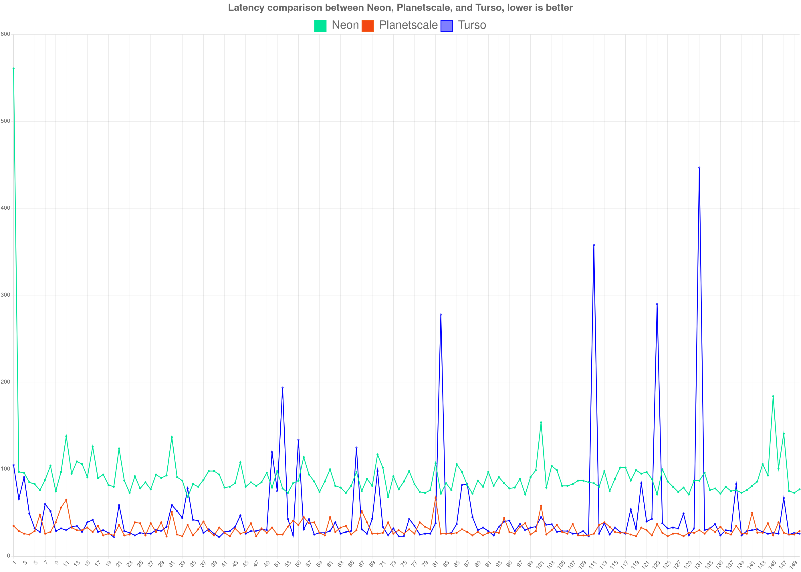

# Serverless DB latencies comparison

comparison made between three serverless DB offerings:

- planetscale
- neon
- turso

neon and turso are using the hobby plan.
planetscale is the scaler pro plan as I was unable to get the hobby plan in time of testing. Will update these

This is only including the query time measured with `performance.now()` right before a query and after it. It does not include http overhead.

## Stack and infrastructure

all DBs were tested in Frankfurt region.
Stack:

- drizzle orm
- cloudflare workers

Neon is using the connection pooler as advised by their docs for serverless environments.

## Conclusions

planetscale seems to have their networking stack setup the best. Their max latency for the simple select query stayed below 67 ms throughout whole test.
Neon is predictable once the instance wakes up, but much slower.
Turso is as fast as PS at times, but has random spikes to 400 ms.
